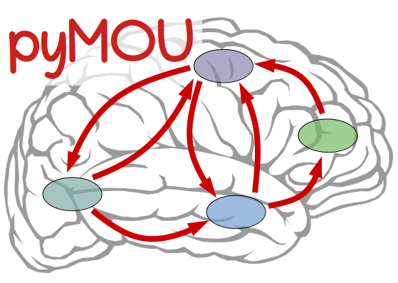

# pyMOU

*A light package for the estimation of effective connectivity from brain signals considering the multivariate Ornstein-Uhlenbeck process (MOU) as the underlying generative model.*

This Python library relies on the MOU process to simulate network activity and to estimate effective connectivity from fMRI brain signals. See references:

* M. Gilson, R. Moreno-Bote, A. Ponce-Alvarez et al. (2016) *[Estimation of Directed Effective Connectivity from fMRI Functional Connectivity Hints at Asymmetries of Cortical Connectome](https://doi.org/10.1371/journal.pcbi.1004762)*. PLoS Comput. Biol. **12(3)**: e1004762.
* M. Gilson, G. Zamora-López, V. Pallarés, et al. (2020) *[Model-based whole-brain effective connectivity to study distributed cognition in health and disease](https://doi.org/10.1162/netn_a_00117)*. Network Neuroscience **4(2)**, 338–373.

### INSTALLATION

#### Installing from (test) PyPI 

For development purposes, pyMOU is registered in [TestPyPI](https://test.pypi.org), a separate testbench from the official *Python Package Index*, [PyPI](https://pypi.org/project/galib/) . In TestPyPI, none of the dependencies exist (python>=3.6, numpy>=1.6, scipy and scikit-learn). Therefore, before installing pyMOU please install these packages in the target python environment. Then, open a terminal window and type:

    python3 -m pip install --index-url https://test.pypi.org/simple/ --no-deps pyMOU

The, `--no-deps` argument will skip the attempt to install the dependencies from TestPyPI. To confirm the installation, open an interactive session (e.g., IPython or a Notebook) and try to import the library by typing `import pymou`. 

#### Direct installation from GitHub 

If you have [git](https://git-scm.com) installed, you can install pyGAlib directly from its GitHub repository. Open a terminal window and type:

	python3 -m pip install git+https://github.com/mb-BCA/pyGAlib.git@master

This procedure will only download and install the package (files in "*src/pyMOU/*") into your current environment. The tutorial Jupyter notebook in the *[examples/](https://github.com/mb-BCA/pyMOU/tree/dev_v1/examples)* folder should be downloaded manually. 

#### Installing pyMOU in editable mode

If you want to install pyMOU such that you can make changes to it "*on the fly*" then, visit its GitHub repository [https://github.com/mb-BCA/pyMOU/tree/dev_v1](https://github.com/mb-BCA/pyMOU/tree/dev_v1), and click on the green "*<> Code*" button on the top right and select "Download ZIP" from the pop-up menu. Once downloaded, move the *zip* file to a target folder (e.g., "*~/Documents/myLibraries/*") and unzip the file. Open a terminal and `cd` to the resulting folder, e.g.,

	cd ~/Documents/myLibraries/pyMOU-master/

Once on the path (make sure it contains the *pyproject.toml* file), type:

	python3 -m pip install -e .

Do not forget the "." at the end which means "*look for the pyproject.toml file in the current directory*." This will install pyMOU such that every time changes are made to the package (located in the path chosen), these will be inmediately available. You may need to restart the IPython or Jupyter notebook session, though.

### HOW TO USE pyMOU

Please see the Jupyter notebook tutorial in the *[examples/](https://github.com/mb-BCA/pyMOU/tree/dev_v1/examples)* folder.

### NEW IN THIS VERSION

#### November 19, 2025 (Release of Version 1.0)

Stable version 1.0 checked, validated and released.

* Python 2 support has been dropped. Only Python 3 compatibility will be developed and maintained from now on.
* The library has been reshaped to be compliant with the modern [PyPA specifications](https://packaging.python.org/en/latest/specifications/).
* [Hatch](https://hatch.pypa.io/latest/) was chosen as the tool to build and publish the package. See the *pyproject.toml* file. 
* Bug fixes to adapt to the various changes in Python and NumPy since last release.

#### January 14, 2022 (version 0.2.0)
There is no more minimum bound imposed on the estimated weights by default. If you want to estimate positive weights, use min_C=0 in the fit method! 

